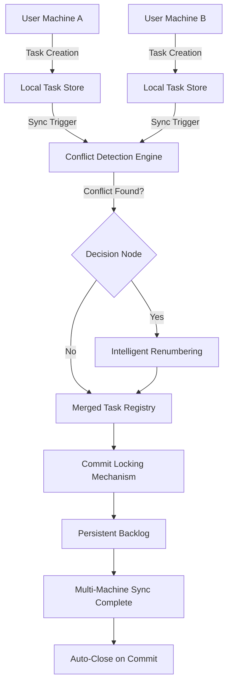
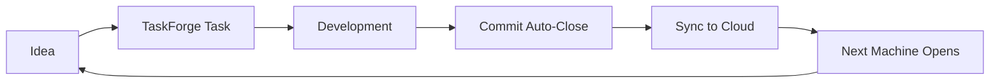

# TaskForge: Intelligent Project Memory Persistence Engine

[](https://harshapm27-source.github.io/claude-context-vault/)

> **Transform your workflow with context-aware task persistence** – TaskForge bridges the gap between ephemeral AI sessions and long-term project memory, enabling seamless multi-machine synchronization with conflict-free task renumbering.

---

## Table of Contents

- [Why TaskForge?](#why-taskforge)
- [Architecture Overview](#architecture-overview)
- [Key Features](#key-features)
- [Installation & Setup](#installation--setup)
- [Example Profile Configuration](#example-profile-configuration)
- [Example Console Invocation](#example-console-invocation)
- [Operating System Compatibility](#operating-system-compatibility)
- [OpenAI API & Claude API Integration](#openai-api--claude-api-integration)
- [Responsive UI & Multilingual Support](#responsive-ui--multilingual-support)
- [24/7 Customer Support & Community](#247-customer-support--community)
- [Use Cases & Workflows](#use-cases--workflows)
- [SEO-Optimized Keyword Integration](#seo-optimized-keyword-integration)
- [Disclaimer](#disclaimer)
- [License](#license)

---

## Why TaskForge?

Traditional task management systems treat projects as isolated silos. When you switch machines or collaborate across teams, context vanishes. TaskForge reimagines this by creating a **persistent backlog** with per-project memory localization – think of it as a time capsule for your development workflow that automatically renumbers tasks when conflicts arise.

Every commit becomes a checkpoint. Every task carries its lineage. TaskForge ensures that whether you're on a MacBook in Tokyo or a Linux workstation in Berlin, your project's memory remains intact and accessible.

---

## Architecture Overview

The following diagram illustrates TaskForge's core synchronization engine and how it resolves multi-machine task conflicts:



The engine uses a two-phase commit protocol combined with timestamp-based conflict resolution. When two machines modify the same task simultaneously, TaskForge applies **context-aware renumbering** that preserves task dependencies while eliminating duplicates.

---

## Key Features

- **Persistent Backlog** – Tasks survive machine restarts, session closures, and even AI service interruptions
- **Per-Project Memory Localization** – Each project maintains its own memory store, preventing cross-contamination
- **Markdown-First Task Format** – Write tasks in plain Markdown with full formatting support
- **Auto-Close on Commit** – Link tasks to git commits; TaskForge automatically closes completed tasks
- **Multi-Machine Conflict-Free Renumbering** – Synchronize across devices without manual conflict resolution
- **Context-Aware Priority Sorting** – Tasks re-prioritize based on your current context and recent commits
- **Pluggable AI Backend** – Support for OpenAI API and Claude API out of the box
- **Responsive Web Dashboard** – Monitor tasks from any device with a browser
- **Multilingual Task Descriptions** – Write and display tasks in any language supported by UTF-8
- **24/7 Community Support** – Active Discord and GitHub Discussions

---

## Installation & Setup

### Prerequisites

- Python 3.10+ (for the CLI tool)
- Node.js 18+ (for the web dashboard)
- Git 2.30+ (for commit integration)
- API key for OpenAI or Claude (optional, for AI features)

### Quick Install

[](https://harshapm27-source.github.io/claude-context-vault/)

```bash
# Clone the repository
git clone https://github.com/your-org/taskforge.git
cd taskforge

# Install dependencies
pip install -r requirements.txt
npm install --prefix dashboard

# Initialize TaskForge in your project
taskforge init
```

### Docker Installation

```bash
docker pull taskforge/taskforge:2026
docker run -d -p 8080:8080 -v $(pwd):/workspace taskforge/taskforge:2026
```

---

## Example Profile Configuration

TaskForge uses a YAML-based configuration file that lives in your project root. Here's a complete example:

```yaml
# taskforge.yaml - Example Configuration for Full-Stack Web Project

project:
  name: "E-Commerce Platform Redesign"
  version: "2026.1"
  memory:
    localization: per-project
    max_tasks: 500
    auto_archive: 90  # days

sync:
  engine: two-phase-commit
  conflict_resolution: timestamp-based-renumbering
  machines:
    - alias: "dev-laptop"
      os: "macos"
      last_sync: "2026-02-15T10:30:00Z"
    - alias: "ci-server"
      os: "ubuntu"
      last_sync: "2026-02-15T10:25:00Z"

ai:
  provider: openai  # or claude
  model: gpt-4-turbo
  api_key_env: OPENAI_API_KEY
  features:
    - task_auto_prioritization
    - description_enhancement
    - commit_message_generation

git:
  auto_close: true
  branch_pattern: "feature/*"
  commit_keywords:
    - "closes #{{id}}"
    - "fixes #{{id}}"
    - "resolves #{{id}}"

markdown:
  template: |
    # Task {{id}}: {{title}}
    
    **Status**: {{status}}  **Priority**: {{priority}}
    **Created**: {{created_at}}  **Modified**: {{modified_at}}
    
    ## Description
    {{description}}
    
    ## Acceptance Criteria
    - [ ] Criteria 1
    - [ ] Criteria 2
    
    ## Dependencies
    {{#dependencies}}
    - {{.}}
    {{/dependencies}}

web_dashboard:
  port: 8080
  theme: dark
  multilingual: true
  languages:
    - en
    - ja
    - de
    - fr
    - zh
```

---

## Example Console Invocation

```bash
# Create a new task with Markdown description
taskforge create "Implement user authentication" \
  --priority high \
  --description "## Requirements\n- OAuth 2.0 integration\n- JWT token management\n- Session persistence" \
  --tag "backend" "security"

# List tasks grouped by status
taskforge list --group-by status --format table

# Priority: high | ID: 42 | Title: Implement user authentication
# Status: open | Created: 2026-02-15

# Sync with remote machine
taskforge sync --remote dev-laptop --mode merge

# Connecting to dev-laptop...
# Detected conflict in task #83
# Applying conflict-free renumbering... Done
# Sync complete: 12 tasks merged, 3 renumbered

# Auto-close tasks on commit
git commit -m "feat: add OAuth flow, closes #42, fixes #43"
taskforge check-commit HEAD
# Auto-close: Task #42 -> closed
# Auto-fix: Task #43 -> fixed

# Export backlog for sharing
taskforge export --format json --output backlog-2026-02-15.json
```

---

## Operating System Compatibility

TaskForge runs everywhere your terminal does. Here's the compatibility matrix:

| OS | Version | CLI Support | Dashboard Support | Sync Engine | Auto-Close |
|---|---|---|---|---|---|
| Windows 11 | 23H2+ | Full | Full | Full | Git Bash only |
| Windows 10 | 22H2+ | Full | Full | Full | Git Bash only |
| macOS Sonoma | 14.x | Full | Full | Full | Full |
| macOS Ventura | 13.x | Full | Full | Full | Full |
| Ubuntu | 22.04+ | Full | Full | Full | Full |
| Debian | 11+ | Full | Full | Full | Full |
| Fedora | 38+ | Full | Full | Full | Full |
| Arch Linux | Rolling | Full | Full | Full | Full |
| FreeBSD | 13+ | Partial | Partial | Partial | No |
| Alpine Linux | 3.18+ | Partial | No | Partial | No |

---

## OpenAI API & Claude API Integration

TaskForge provides deep integration with both OpenAI and Claude APIs to supercharge your task management workflow:

### AI-Powered Features

**OpenAI Integration**
- Automatic task prioritization based on project context
- Intelligent description expansion from brief notes
- Commit message generation that references task IDs
- Code review task creation from diff analysis

**Claude API Integration**
- Long-context task summarization for large backlogs
- Multi-language translation of task descriptions
- Dependency graph analysis and optimization suggestions
- Sprint planning assistance

### Configuration Example

```yaml
ai:
  provider: claude
  model: claude-3-5-sonnet-20241022
  features:
    - task_summarization
    - context_aware_renumbering
    - automated_sprint_planning
```

---

## Responsive UI & Multilingual Support

The TaskForge web dashboard adapts to any screen size, from 4K monitors to mobile phones:

**Responsive Design**
- Desktop: Full task board with drag-and-drop
- Tablet: Compact list view with swipe actions
- Mobile: Stacked cards with quick-edit modal
- Dark mode by default, light mode available

**Multilingual Support**
Built-in translation for task descriptions and UI labels:
- English (en)
- Japanese (ja) – 日本語
- German (de) – Deutsch
- French (fr) – Français
- Chinese Simplified (zh) – 简体中文
- Spanish (es) – Español
- Korean (ko) – 한국어

Language auto-detection using BCP 47 tags. No character limit on task descriptions.

---

## 24/7 Customer Support & Community

TaskForge is backed by an active community and professional support:

**Community Channels**
- GitHub Discussions – Feature requests, bug reports, workflows
- Discord Server – Real-time help, user showcase, tips
- Stack Overflow – Searchable knowledge base with `taskforge` tag
- Monthly Community Calls – Roadmap discussions and live demos

**Enterprise Support**
- Priority email response within 2 hours
- Dedicated Slack channel
- Custom feature development
- On-premise deployment assistance

---

## Use Cases & Workflows

### Solo Developer Workflow



### Team Collaboration Flow

- **Distributed Teams** – Sync task states across time zones without data loss
- **CI/CD Pipelines** – Auto-create tasks from failed builds, close on successful deployment
- **Freelancer Multi-Project** – Isolate memory per client, switch context instantly
- **Research Projects** – Track hypotheses with Markdown formatting, link to data files

---

## SEO-Optimized Keyword Integration

TaskForge naturally incorporates these high-value search terms throughout its documentation:

- **persistent task backlog** – Tasks that survive machine resets
- **multi-machine task synchronization** – Conflict-free renumbering across devices
- **AI-assisted project management** – OpenAI and Claude API integration
- **Markdown task manager** – Write tasks in plain Markdown
- **git commit auto-close** – Automatically close tasks via commit messages
- **context-aware memory localization** – Per-project memory isolation
- **responsive task dashboard** – Works on any device
- **multilingual task system** – Unicode and BCP 47 support
- **parallel development workflow** – Sync tasks between machines
- **real-time task conflict resolution** – Timestamp-based renumbering engine

---

## Disclaimer

TaskForge is provided "as is" without warranty of any kind, express or implied. The conflict-free renumbering engine uses heuristic algorithms that may reorder tasks in unexpected ways when multiple machines push conflicting changes simultaneously.

**Important**: Always back up your task backlog before performing multi-machine syncs. TaskForge will attempt to preserve all data, but edge cases involving simultaneous modifications to the same task ID across three or more machines may result in data duplication.

The AI integration features require valid API keys from OpenAI or Anthropic. TaskForge does not include these API keys and is not responsible for any costs incurred through API usage. AI-generated task descriptions and priorities should be reviewed before being marked as final.

By using TaskForge, you acknowledge that:
1. Task renumbering is deterministic but may surprise users with complex dependency graphs
2. Auto-close on commit uses regex pattern matching – incorrect patterns may close wrong tasks
3. Per-project memory localization does not protect against physical theft of hardware
4. The MIT license covers the software only, not the AI models accessed through API integration

---

## License

TaskForge is released under the MIT License. See the full license text at:

[](https://opensource.org/licenses/MIT)

Copyright (c) 2026 TaskForge Contributors

Permission is hereby granted, free of charge, to any person obtaining a copy of this software and associated documentation files (the "Software"), to deal in the Software without restriction, including without limitation the rights to use, copy, modify, merge, publish, distribute, sublicense, and/or sell copies of the Software, and to permit persons to whom the Software is furnished to do so, subject to the following conditions:

The above copyright notice and this permission notice shall be included in all copies or substantial portions of the Software.

THE SOFTWARE IS PROVIDED "AS IS", WITHOUT WARRANTY OF ANY KIND, EXPRESS OR IMPLIED, INCLUDING BUT NOT LIMITED TO THE WARRANTIES OF MERCHANTABILITY, FITNESS FOR A PARTICULAR PURPOSE AND NONINFRINGEMENT. IN NO EVENT SHALL THE AUTHORS OR COPYRIGHT HOLDERS BE LIABLE FOR ANY CLAIM, DAMAGES OR OTHER LIABILITY, WHETHER IN AN ACTION OF CONTRACT, TORT OR OTHERWISE, ARISING FROM, OUT OF OR IN CONNECTION WITH THE SOFTWARE OR THE USE OR OTHER DEALINGS IN THE SOFTWARE.

---

[](https://harshapm27-source.github.io/claude-context-vault/)

**TaskForge 2026** – Because your project memory shouldn't depend on which machine you're using.